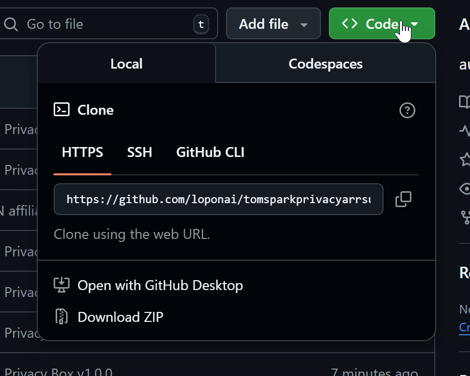

# Privacy Box

**One-click secure media server setup for Windows.**

A PowerShell script that automatically deploys a complete *arr stack (Sonarr, Radarr, Prowlarr, qBittorrent) routed through a VPN tunnel using Docker.

## Features

- **One-click setup** - No manual file editing required
- **VPN Kill Switch** - All traffic routed through Gluetun (NordVPN)
- **Pre-configured ports** - Avoids common Windows/Hyper-V port conflicts
- **Guided configuration** - Step-by-step instructions for connecting all apps
- **Safe defaults** - Credentials properly quoted, secure settings enabled

## What Gets Installed

| Service | Port | Description |
|---------|------|-------------|
| qBittorrent | `localhost:8080` | Torrent client |
| Prowlarr | `localhost:8181` | Indexer manager |
| Sonarr | `localhost:8989` | TV show manager |
| Radarr | `localhost:7878` | Movie manager |
| Gluetun | - | VPN tunnel (NordVPN) |

## Requirements

- Windows 10/11
- [Docker Desktop](https://www.docker.com/products/docker-desktop/) with WSL 2
- [NordVPN subscription](https://nordvpn.tomspark.tech/) - Fastest speeds based on [RealVPNSpeeds.com](https://realvpnspeeds.com)

## Quick Start

1. **Download** - Click the green "Code" button, then "Download ZIP"

   

2. **Extract** the ZIP file to your Desktop
3. **Double-click** `Setup-PrivacyBox.bat`
4. **Follow the prompts** - the script will guide you through everything

## What You'll Need

Before running the script, get your **NordVPN Service Credentials**:

1. Go to [NordVPN Manual Setup](https://my.nordaccount.com/dashboard/nordvpn/manual-configuration/)
2. Click "Set up NordVPN manually"
3. Copy the **Username** and **Password** shown (NOT your email login!)

## Manual Commands

```bash
# Start the stack
docker compose up -d

# Stop the stack
docker compose down

# View VPN logs
docker logs gluetun

# Check container status
docker ps
```

## Troubleshooting

### AUTH_FAILED Error
- You're using your NordVPN email/password instead of Service Credentials
- Go to NordVPN dashboard → Manual Setup → Copy the credentials there

### Port Already in Use
- Windows Hyper-V reserves random ports in the 9000-9999 range
- This script uses port 8181 for Prowlarr to avoid conflicts

### Prowlarr Shows Few Indexers
- Change the Language filter from "en-US" to "Any"
- Most indexers are tagged as "English" not "en-US"

### qBittorrent Password Not Working
```bash
docker logs qbittorrent 2>&1 | findstr password
```

## Architecture

```
┌─────────────────────────────────────────────────────────┐
│                      INTERNET                           │
└─────────────────────┬───────────────────────────────────┘
                      │
                      ▼
┌─────────────────────────────────────────────────────────┐
│                 GLUETUN (VPN Tunnel)                    │
│              NordVPN OpenVPN Connection                 │
│                   Your IP: Hidden                       │
├─────────────────────────────────────────────────────────┤
│  ┌─────────────┐ ┌─────────────┐ ┌─────────────┐       │
│  │ qBittorrent │ │   Sonarr    │ │   Radarr    │       │
│  │   :8080     │ │   :8989     │ │   :7878     │       │
│  └─────────────┘ └─────────────┘ └─────────────┘       │
│         ┌─────────────┐                                 │
│         │  Prowlarr   │                                 │
│         │   :8181     │                                 │
│         └─────────────┘                                 │
└─────────────────────────────────────────────────────────┘

All containers share Gluetun's network = Zero IP leaks
```

## License

MIT License - Use freely, modify freely, share freely.

## Support This Project

This project is free and open source. If you'd like to support development:

[](https://nordvpn.tomspark.tech/)

**[Get NordVPN](https://nordvpn.tomspark.tech/)** - The VPN used in this guide. Fastest speeds based on [RealVPNSpeeds.com](https://realvpnspeeds.com) testing.

## Credits

- [Gluetun](https://github.com/qdm12/gluetun) - VPN client
- [LinuxServer.io](https://www.linuxserver.io/) - Docker images
- Tom Spark - Original tutorial

---

**Disclaimer:** This tool is for legal purposes only. Respect copyright laws in your jurisdiction.
